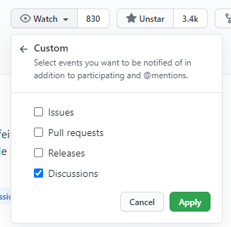

<h1 align="center">Fórum</h1>

:beer: Portando discussões feitas em grupos para o GitHub.

> **Disclaimer:** _As opiniões aqui publicadas são de inteira responsabilidade de seus autores e não refletem, necessariamente, o posicionamento da organização._

_____

  

_____

## Propósito

Uma [conversa no Twitter](https://twitter.com/felipefialho_/status/693111161856921600) foi o gatilho que precisávamos.

Alguns posts em grupos de front-end em redes sociais geram debates legais que poderiam ser disponibilizados em local melhor estruturado para tal. A busca do Facebook em grupos, por exemplo, tem vários problemas. Discussões épicas foram perdidas, e pessoas que ingressam agora nos grupos não tem mais acesso a esses posts.

A ideia desse repositório é portar ou iniciar essas discussões no GitHub. Estando no GitHub, fica mais fácil procurar respostas a perguntas já respondidas por esses grupos.

O objetivo é unificar todas as discussões em um só local, e o GitHub foi o escolhido para isso.

Em 2017, depois de tantas conquistas (empregos, conhecimento e networking) e elogios (por parte do TechLead do GitHub), nos tornamos a **comunidade oficial do evento InterCon do iMasters**.

## Vantagens do GitHub

* Espaço usado por quase todos os desenvolvedores
* É uma rede social
* A busca funciona muito bem
* Escalável
* Organizável

## Ajude e seja lembrado!

Toda vez que alguém faz uma pergunta e sua resposta é marcada como correta, você ganha um ponto e pode aparecer no ranking das pessoas que mais ajudam.

  

Além disso, seu perfil no GitHub também irá mostrar quantas discussões você já respondeu!

  

## Diretrizes e Boas Práticas

Antes de criar uma pergunta/discussão você deve atentar para as seguintes diretrizes:

### Pesquise

Uma habilidade essencial para os desenvolvedores é saber fazer boas pesquisas. Muitas das dúvidas de iniciantes podem ser respondidas com pesquisas simples, portanto antes de postar sua dúvida certifique-se de que fez as pesquisas necessárias e traga para dentro da pergunta/discussão os dados que encontrou e os dados que não encontrou sobre o assunto.

#### Pesquise no fórum

1. Utilize a função de busca no topo desse repositório (certifique-se de não estar em um *fork*)

2. Pesquise assuntos próximos, talvez sua dúvida possa ter sido respondida em alguma pergunta/discussão parecida

#### Pesquise na internet

1. Caso sua dúvida seja sobre uma linguagem ou ferramenta específica, busque sua dúvida na documentação oficial dessa linguagem/ferramenta

2. Caso o item acima não resolva, utilize preferêncialmente o [Google](https://www.google.com)

3. Tente pesquisar em inglês, nem que pra isso precise recorrer ao [Google Translate](https://translate.google.com)

4. Dê preferência para resultados de documentações oficiais e fóruns especializados, exemplo:
  * [Mozilla Developer Network (MDN)](https://developer.mozilla.org/pt-BR/)
  * [StackOverflow](https://stackoverflow.com/)

### Outros pontos

* Escreva o português de forma correta e bem pontuado.
* Evite sair do escopo inicial da pergunta/discussão. Caso necessário, crie uma nova pergunta/discussão e mencione a pergunta/discussão.
* Se precisar de ajuda em um código, forneça trechos, [Gists](https://gist.github.com/), e lembre-se, ninguém tem a obrigação de resolver seu problema.
* Não seja um monólogo que só fala de si. Interaja com as respostas, cite pessoas, gere uma discussão saudável e construtiva. Afinal, quanto mais informações, mais rico nosso ambiente será e ajudará mais pessoas.

## Quando criar uma Pergunta/Discussão?

### Dúvidas

Concentre suas perguntas em problemas reais. Inclua detalhes sobre o que você tentou e exatamente o que você está tentando fazer.

O ideal é que antes de criar uma dúvida você tente resolver o problema sozinho, na grande maioria das vezes uma breve busca no Google pode te ajudar a encontrar uma solução.

Pergunte sobre:
- Como resolver um determinado problema ex: `Como alterar a cor de fundo de uma div com CSS`.
- Como executar uma determinada tarefa ex: `Como consumir um webservice REST com JavaScript`.
- Como otimizar um trecho de código ex: `Como percorrer todas as propriedades de um objeto rapidamente`.

Lembre-se de pesquisar bastante antes de abrir uma pergunta/discussão, existem boas chances da sua dúvida já ter sido respondida e estar documentada pela internet.

### Discussões

Discussões são sempre bem-vindas, ao formular uma discussão, tente ser o mais direto possível sobre o que você pretende abordar, se necessário abra mais de uma thread, uma para cada assunto.

### Ferramentas

Descobriu uma ferramenta, framework ou qualquer outro recurso que possa ajudar os membros do grupo? Não hesite em compartilhar conosco estamos ansiosos pela sua dica. Existe uma categoria só para [dicas assim](https://github.com/frontendbr/forum/discussions?discussions_q=category%3ADicas).

### Geral

Caso seu post não se encaixe em nenhuma das categorias acima, não tem problema. Desde que ele trate sobre Front-End estaremos dispostos a discutir e ajudar. E você pode abrir com a [categoria discussão](https://github.com/frontendbr/forum/discussions?discussions_q=category%3ADiscuss%C3%A3o).

## Sua pergunta foi respondida?

Se alguém respondeu sua pergunta corretamente, não deixe de marcar a resposta como respondida. Isso ajuda a filtrar as perguntas, além de dar um ponto para o colega que te ajudou e incentivar que as pessoas se ajudem mais e mais.

  

## Como criar sua Pergunta/Discussão?

### Trechos de código

Para facilitar a visualização de quem vai ler sua pergunta/discussão, coloque seu código no [Codepen](https://codepen.io/) (recomendadíssimo) ou no Gist. Assim quem for te ajudar conseguirá ver seu código em funcionamento, facilitando as dicas.

## Código de Conduta

Como qualquer grupo de discussões, existem algumas regras que devem ser seguidas para proporcionar uma melhor experiência à todos.

* Respeite para ser respeitado. Não escreva algo que possa ofender alguém. Reflita se o texto não é agressivo/mal educado antes de enviar.
* Mantenha as críticas nas idéias e não nas pessoas.
* Não será permitido qualquer tipo de assédio ou discriminação relacionados a características ou escolhas pessoais, bem como bullying, sexismo, racismo ou qualquer outro tipo de ação que possa proporcionar constrangimento aos outros participantes.

Comporte-se profissionalmente. Os participantes que violarem tais regras serão convidados a se retirar ou banidos dada a gravidade de suas ações.

## Linguagem

**Todas** as issues devem ser abertas e respondidas em **pt-br**.

## Perguntas frequentes

Várias dúvidas e perguntas de como iniciar a carreira e por onde começar a estudar, nossa sugestão é que você inicie lendo essas issues e logo depois abra uma nova com suas dúvidas:

### Técnicas e metodologias

- [#229](https://github.com/frontendbr/forum/discussions/229) Livros
- [#480](https://github.com/frontendbr/forum/discussions/480) Como funciona o processo de **Code Review** onde vocês trabalham?

### HTML

- [#38](https://github.com/frontendbr/forum/discussions/38) Referências sobre HTML e um monte de conhecimento sobre o que é uma linguagem de marcação e de transporte

### JavaScript

- [#90](https://github.com/frontendbr/forum/discussions/90) Paradigmas de programação com JavaScript
- [#270](https://github.com/frontendbr/forum/discussions/270) Roadmap sobre por onde ir no JavaScript

## Como receber atualizações do Fórum

Você pode receber atualizações do Fórum no seu email ou via notificações do GitHub, basta clicar em **Watch**, em seguida, basta ir em **Custom** e marcar a opção de **Discussions**.

## Extra

No Slack [Frontend Brasil](http://frontendbrasil.slack.com/) tem o canal `#forum` que está integrado com o **GitHub**, desta forma, você sempre saberá quando alguém postou uma nova **issue**.

**Entre e participe!**

Badge | Link | Participar
----- | ---- | ----------
 | [Frontend Brasil](http://frontendbrasil.slack.com/) | [Participar](http://frontendbrasil-slack.herokuapp.com/)

## Apoiadores e Parceiros

  

## Licença

[MIT](LICENSE) &copy; FrontendBR

## Repositórios da Front-End Brasil

- [Fórum](https://github.com/frontendbr/forum)
- [Eventos](https://github.com/frontendbr/eventos)
- [Vagas](https://github.com/frontendbr/vagas)
- [Me Contrata](https://github.com/frontendbr/me-contrata)
- [Compra e Venda](https://github.com/frontendbr/compra-e-venda)
- [Doe um Livro](https://github.com/frontendbr/doe-um-livro)
- [Poste Mais!](https://github.com/frontendbr/poste-mais)
- [Open Source](https://github.com/frontendbr/open-source)
- [Sugestões](https://github.com/frontendbr/sugestoes)
